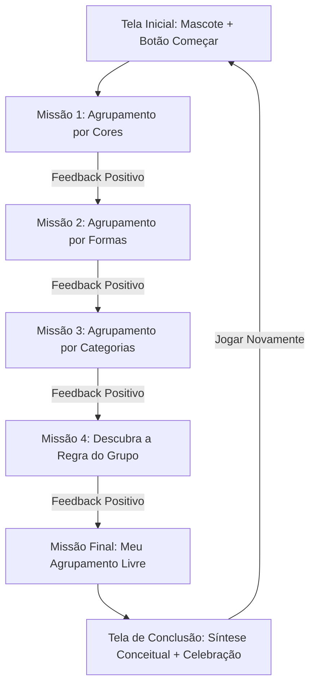

# Especificação Funcional — Missão dos Agrupamentos

**Documento**: Especificação Funcional e Pedagógica de Software Educacional  
**Projeto**: Missão dos Agrupamentos  
**Versão**: 1.0.0  
**Público-Alvo**: Alunos do 1º ano do Ensino Fundamental (Faixa etária: 6 a 7 anos)  
**Referência Curricular**: BNCC Computação — Habilidade **EF01CO01**  
**Ambiente de Execução**: Web Estática (GitHub Pages — Desktop, Tablet e Mobile)  

---

## 1. Visão Geral e Contexto Pedagógico

### 1.1 Objetivo Geral
Desenvolver uma aplicação web educativa, 100% estática, interativa e de fácil acesso, para apoiar crianças do 1º ano do Ensino Fundamental na construção do pensamento computacional e no desenvolvimento do raciocínio lógico por meio da observação de atributos, classificação e agrupamento de objetos sob múltiplos critérios.

### 1.2 Alinhamento com a BNCC de Computação
- **Código da Habilidade**: `EF01CO01`
- **Descrição da Habilidade**: *"Reconhecer que os objetos podem ser agrupados de diferentes maneiras a partir de características comuns (como cor, forma, tamanho, textura, categoria/uso etc.) e descrever as características de cada agrupamento."*
- **Eixo do Pensamento Computacional**:
  - **Reconhecimento de Padrões**: Identificar semelhanças e diferenças entre elementos visuais.
  - **Abstração**: Focar nas características relevantes para um agrupamento específico (ex.: focar na cor e ignorar a forma; focar na categoria e ignorar o tamanho).
  - **Algoritmos e Regras**: Compreender e deduzir regras lógicas que definem o pertencimento a um conjunto.

### 1.3 Personagem Guia (Mascote)
- **Nome**: *Lino, o Guaxinim Curioso* (ou *Robô Lipe*).
- **Função**: Atuar como facilitador pedagógico, apresentando instruções em linguagem acolhedora, fornecendo pistas visuais e narrativas (com botão de áudio/locução) e celebrando conquistas sem elementos punitivos.

---

## 2. Personas e Cenários de Uso

### 2.1 Persona Principal
- **Nome**: Miguel / Clara (6 a 7 anos).
- **Etapa Escolar**: 1º ano do Ensino Fundamental (fase de alfabetização inicial).
- **Comportamento Digital**: Utiliza tablets e celulares com toques na tela; autonomia de leitura ainda em desenvolvimento (precisa de suporte visual, ícones intuitivos e instruções auditivas).
- **Necessidade**: Instruções diretas, áreas de toque grandes, retorno visual imediato e feedbacks incentivadores.

### 2.2 Cenário de Uso
- **Em sala de aula / laboratório de informática**: Uso mediado pelo professor em lousa digital, computadores ou tablets compartilhados.
- **Em casa / smartphone**: Atividade complementar assíncrona, acessada via link direto do GitHub Pages, sem necessidade de login, senhas ou instalação.

---

## 3. Arquitetura de Informação e Fluxo de Navegação



---

## 4. Detalhamento Funcional das Telas e Missões

### 4.1 Tela Inicial (Boas-Vindas e Ambientação)
- **Elementos Visuais**:
  - Título lúdico e contrastante: **"Missão dos Agrupamentos"**.
  - Ilustração acolhedora do mascote guia acenando.
  - Cartão de instrução com ícone de autofalante (botão de ouvir instrução).
  - Botão principal em destaque: **"Começar Missão"** (com efeito de pulso suave e ícone de play).
- **Texto da Instrução**:
  > *"Olá, amiguinho! Sou o Lino. Vamos descobrir como os objetos podem se juntar de jeitos diferentes? Clique em 'Começar'!"*
- **Comportamento**:
  - Ao clicar em "Começar", a aplicação inicia a Missão 1 com uma transição suave.
  - Reprodução opcional de trilha sonora leve (com botão visível de ativar/desativar som no cabeçalho).

---

### 4.2 Missão 1 — O Desafio das Cores
- **Objetivo**: Selecionar elementos que compartilham a mesma cor, isolando essa propriedade dos demais atributos.
- **Estrutura da Tela**:
  - **Instrução Superior**: *"Ajude o Lino a encontrar todos os objetos da cor **[AMARELA]**!"* (com indicador visual da cor em destaque).
  - **Área de Objetos (Grid com 6 itens)**:
    - Exemplo: Banana (amarela), Sol (amarelo), Pato de borracha (amarelo), Maçã (vermelha), Sapo (verde), Bola azul (azul).
  - **Área de Destino / Cesto de Coleta**: Espaço delimitado onde os itens selecionados se agrupam.
  - **Botão de Confirmação**: *"Verificar Agrupamento"* (habilitado após selecionar ao menos 1 item).
- **Regra de Validação**:
  - Sucesso se todos os 3 objetos amarelos forem selecionados e nenhum de outra cor.
- **Feedback**:
  - *Adequado*: *"Excelente! A banana, o sol e o patinho são todos **amarelos**! Eles formam o grupo do amarelo!"*
  - *Ajuste Necessário*: *"Olhe bem as cores de cada objeto! Tem algum aí que não é amarelo? Tente novamente!"*

---

### 4.3 Missão 2 — O Enigma das Formas
- **Objetivo**: Identificar objetos que possuem características de forma semelhantes (ex.: formato circular/redondo vs. quadrado/retangular).
- **Estrutura da Tela**:
  - **Instrução Superior**: *"Vamos reunir tudo o que tem formato **REDONDO** (círculo)!"* (com ícone visual de círculo).
  - **Área de Objetos (Grid com 6 itens)**:
    - Exemplo: Moeda (redonda), Botão (redondo), Relógio de parede circular (redondo), Livro (retangular), Caixa de presente (quadrada), Janela quadrada (quadrada).
- **Regra de Validação**:
  - Identificar e selecionar os 3 objetos com contorno e formato circular.
- **Feedback**:
  - *Adequado*: *"Muito bem! A moeda, o botão e o relógio têm a mesma forma: todos são **redondos**!"*
  - *Ajuste Necessário*: *"Passe o dedinho no contorno dos objetos. Procure os que não têm pontas e são redondinhos!"*

---

### 4.4 Missão 3 — O Baú das Categorias
- **Objetivo**: Agrupar itens com base na sua função/natureza (animais, alimentos, brinquedos ou meios de transporte).
- **Estrutura da Tela**:
  - **Instrução Superior**: *"Coloque no baú apenas as figuras que são **ANIMAIS**!"* (com ícone de pegada/bichinho).
  - **Área de Objetos (Grid com 6 itens variados)**:
    - Exemplo: Cachorro (animal), Gatinho (animal), Elefante (animal), Carro (transporte), Maçã (alimento), Pião (brinquedo).
- **Regra de Validação**:
  - Selecionar os 3 elementos pertencentes à categoria biológica/animal.
- **Feedback**:
  - *Adequado*: *"Perfeito! O cachorro, o gatinho e o elefante são todos **animais vivos**!"*
  - *Ajuste Necessário*: *"Atenção: algum desses itens não é um bichinho? Veja se tem algum brinquedo ou transporte misturado!"*

---

### 4.5 Missão 4 — Descubra a Regra Secreta
- **Objetivo**: Desenvolver o raciocínio indutivo e o reconhecimento de padrões, analisando um grupo já formado e descobrindo a regra comum.
- **Estrutura da Tela**:
  - **Grupo em Exibição (Pré-agrupado)**:
    - Carro de bombeiros (vermelho), Morango (vermelho), Maçã (vermelha), Coração (vermelho).
  - **Pergunta do Mascote**: *"O que todos esses objetos têm em comum?"*
  - **Opções de Resposta (Botões ilustrados com pictogramas)**:
    - [A] 🍎 *Todos são coisas de comer* (Incorreta, pois carro de bombeiros e coração não são alimentos).
    - [B] 🔴 *Todos possuem a cor vermelha* (Correta).
    - [C] 🚗 *Todos são meios de transporte* (Incorreta).
- **Regra de Validação**:
  - Selecionar a opção que generaliza corretamente todos os elementos do conjunto.
- **Feedback**:
  - *Adequado*: *"Você é um verdadeiro detetive! Embora um seja fruta e outro seja veículo, **todos eles compartilham a cor vermelha**!"*
  - *Ajuste Necessário*: *"Observe com cuidado: o carro de bombeiros é de comer? Pense em algo que pertença a **todos** eles ao mesmo tempo!"*

---

### 4.6 Missão Final — Meu Agrupamento Criativo
- **Objetivo**: Consolidar a autonomia e demonstrar a flexibilidade de agrupamentos (o mesmo objeto pode pertencer a grupos diferentes dependendo da regra).
- **Etapa 1 — Escolha da Regra**:
  - A criança clica no critério que deseja criar:
    - Opção 1: *"Quero juntar por cor: Grupo dos Vermelhos"*
    - Opção 2: *"Quero juntar por categoria: Grupo das Coisas de Comer (Alimentos)"*
    - Opção 3: *"Quero juntar por forma: Grupo das Coisas Redondas"*
- **Etapa 2 — Seleção dos Objetos**:
  - Apresenta um painel com 8 objetos mistos (ex.: Maçã vermelha e redonda, Tomate vermelho e redondo, Bola vermelha e redonda, Melancia verde e redonda, Caixa de presente vermelha e quadrada, Cenoura laranja, Pão marrom, Banana amarela).
  - A criança seleciona os objetos que se encaixam na regra que ela mesma escolheu.
- **Regra de Validação**:
  - Validação dinâmica de acordo com a regra previamente escolhida pelo aluno.
- **Feedback Formativo**:
  - Demonstração visual de como a **Maçã**, por exemplo, entrou no grupo dos vermelhos (por cor), mas também poderia estar no grupo das frutas (por categoria) ou dos redondos (por forma).

---

### 4.7 Tela de Conclusão e Síntese da Aprendizagem
- **Elementos**:
  - Animação festiva lúdica (chuva suave de confetes ou estrelinhas).
  - Quadro de Medalhas: 5 selos/estrelas representando as missões concluídas.
  - **Mensagem Conceitual de Fixação (BNCC EF01CO01)**:
    > **"Parabéns! Você descobriu o segredo dos agrupamentos: Os mesmos objetos podem formar grupos completamente diferentes dependendo da característica que observamos!"**
  - **Botões de Ação**:
    - 🔄 *Jogar Novamente* (reinicia as missões com variações de itens).
    - 🎨 *Fazer Outro Agrupamento* (retorna para a Missão Final).

---

## 5. Diretrizes de Feedback e Design Pedagógico

| Situação | Resposta do Sistema | Exemplo de Texto / Áudio | Recurso Visual |
|---|---|---|---|
| **Escolha Correta** | Validação imediata com reforço explicativo do critério. | *"Sensacional! Todos eles são vermelhos!"* | Brilho dourado, som harmônico agradável, mascote comemorando. |
| **Item Incorreto Selecionado** | Sem bloqueio punitivo; incentivo à reanálise do atributo dissonante. | *"Hum, olhe de perto: este item tem a mesma cor dos outros?"* | Efeito de leve ondulação no item divergente, sem cruz vermelha ou sons estridentes. |
| **Itens Faltando** | Dica quantitativa e observacional. | *"Você já achou alguns! Ainda tem mais um objeto com essa característica escondido. Consegue achar?"* | Mascote apontando com lupa. |

---

## 6. Requisitos Não Funcionais e Tecnológicos

### 6.1 Requisitos de Acessibilidade e Usabilidade Infantil (1º Ano)
- **Linguagem**: Frases com no máximo 8 a 12 palavras, estrutura direta e vocabulário cotidiano.
- **Tipografia**: Fontes legíveis para fase de alfabetização (ex.: *Lexend*, *Comic Neue*, *Andika* ou *Nunito*), tamanho mínimo de `20px` para textos e `28px` para títulos.
- **Interação por Toque**: Alvos de toque (touch targets) com no mínimo `48px x 48px` (recomendado `64px x 64px` com margem de segurança para mãos infantis).
- **Recurso de Áudio (Text-to-Speech / Áudio Nativo)**: Botão de locução em todas as instruções para permitir autonomia a alunos não alfabetizados ou em processo de letramento.
- **Contraste e Cores**: Conformidade WCAG 2.1 AA para contraste; uso de ícones associados a cores para evitar barreiras a crianças daltônicas.

### 6.2 Requisitos de Engenharia de Software
- **Sem Backend / Sem Banco de Dados**: A aplicação é 100% *client-side* (HTML5 semântico, CSS3 responsivo e JavaScript Vanilla moderno modular).
- **Compatibilidade Multiplataforma**:
  - Celulares (Android e iOS) em modo retrato e paisagem.
  - Tablets escolares e iPads.
  - Computadores desktop e notebooks (suporte total a mouse e toque).
- **Hospedagem Estática**: Executável diretamente via GitHub Pages (ou qualquer servidor web estático).
- **Privacidade e LGPD Infantil**: Zero coleta de dados pessoais, zero cookies de rastreamento, sem criação de contas ou telas de login.
- **Performance**: Carregamento instantâneo (< 2 segundos em conexões 3G), imagens vetorizadas (SVG) ou WebP leves, peso total do bundle < 1.5 MB.

---

## 7. Estrutura de Arquivos Sugerida

```
missao-dos-agrupamentos/
├── index.html              # Estrutura semântica SPA (Single Page Application)
├── css/
│   ├── main.css            # Estilos gerais, reset e variáveis de cores
│   ├── components.css      # Cartões de objetos, mascote, botões e modais
│   └── responsive.css      # Media queries para mobile, tablet e desktop
├── js/
│   ├── data.js             # Catálogo de objetos com atributos (cor, forma, categoria)
│   ├── missions.js         # Lógica e regras de validação de cada missão (1 a 5)
│   ├── speech.js           # Utilitário de síntese de voz / Web Speech API
│   ├── ui.js               # Renderização dinâmica e manipulação de DOM
│   └── app.js              # Controlador central do fluxo da aplicação
├── assets/
│   ├── images/             # SVGs e ilustrações dos objetos e do mascote
│   └── sounds/             # Efeitos sonoros suaves (acerto, clique, vitória)
└── README.md               # Documentação de execução e publicação no GitHub Pages
```

---

## 8. Critérios de Aceite e Testabilidade

1. **CA-01 (Navegabilidade Sem Fricção)**: Uma criança de 6 anos consegue iniciar a missão na tela inicial com no máximo 1 toque.
2. **CA-02 (Suporte Auditivo)**: Ao tocar no botão de som de qualquer instrução, a Web Speech API ou arquivo de áudio reproduz a instrução em português claro.
3. **CA-03 (Validação Formativa)**: Ao submeter um agrupamento com erro, a aplicação jamais exibe "Errou" ou mensagem punitiva, exibindo sempre a dica de observação.
4. **CA-04 (Responsividade)**: A interface ajusta o grid de 6 itens para 2 colunas no celular e 3 colunas no tablet/desktop sem cortes de tela ou rolagem horizontal.
5. **CA-05 (Fixação da Habilidade)**: Na missão final e na tela de conclusão, a aplicação demonstra visualmente que a mesma figura pode pertencer a categorias diferentes.
