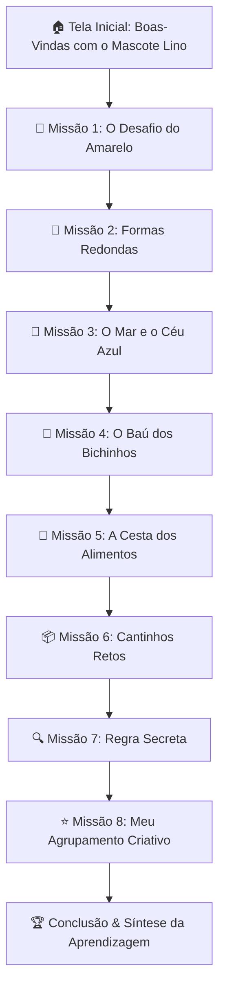

# 🌟 Missão dos Agrupamentos

Aplicação educacional interativa, 100% estática e acessível, desenvolvida para alunos do **1º ano do Ensino Fundamental** (faixa etária de 6 a 7 anos) com foco no desenvolvimento do pensamento computacional e raciocínio lógico.

---

## 🎯 Alinhamento Curricular com a BNCC

- **Código da Habilidade**: `EF01CO01`
- **Descrição da Habilidade**: *"Reconhecer que os objetos podem ser agrupados de diferentes maneiras a partir de características comuns (como cor, forma, tamanho, textura, categoria/uso etc.) e descrever as características de cada agrupamento."*
- **Eixos do Pensamento Computacional**:
  - **Reconhecimento de Padrões**: Identificar propriedades comuns e contrastantes entre itens do cotidiano.
  - **Abstração**: Focar no atributo relevante (ex.: focar na cor e ignorar a forma geométrica).
  - **Flexibilidade Cognitiva**: Perceber que um mesmo objeto pode pertencer a múltiplos grupos dependendo do critério do observador.

---

## 🎮 Estrutura das 8 Missões Educativas



### Detalhamento das Missões:

| # | Missão | Atributo Trabalhado | Itens no Grupo / Regra |
| :---: | :--- | :--- | :--- |
| **1** | **O Desafio do Amarelo** | Cor Primária (Amarelo) | Banana, Sol, Patinho |
| **2** | **O Enigma das Formas Redondas** | Geometria / Contorno (Círculo) | Moeda, Relógio, Botão |
| **3** | **O Mar e o Céu Azul** | Cor Secundária / Identificação (Azul) | Relógio, Botão, Bola, Carro |
| **4** | **O Baú dos Bichinhos** | Categoria Biológica (Animais Vivos) | Cachorrinho, Gatinho, Elefante, Passarinho |
| **5** | **A Cesta dos Alimentos** | Categoria Funcional (Coisas de Comer) | Banana, Maçã, Morango, Cenoura |
| **6** | **O Desafio dos Cantinhos Retos** | Geometria / Formas Retas (Quadrados e Retângulos) | Livro, Caixa de Presente, Janela |
| **7** | **Descubra a Regra Secreta** | Raciocínio Indutivo / Dedução de Padrão | Grupo com Maçã, Morango, Coração e Carro de Bombeiro ("Todos são vermelhos") |
| **8** | **Meu Agrupamento Criativo** | Flexibilidade Cognitiva & Autonomia | O aluno escolhe sua própria regra (Cor, Forma ou Categoria) e seleciona os objetos |

---

## 💡 Diretrizes de Feedback Pedagógico (Sem Punição)

- **Feedback de Sucesso**: Comemoração positiva imediata acompanhada de explicação verbal e textual da característica que une os objetos.
- **Feedback Formativo (Ajuste)**: O sistema **nunca** exibe mensagens secas de "errado" ou penalidades. Ele oferece uma dica acolhedora incentivando a criança a observar os atributos novamente.
- **Andaime Pedagógico (Scaffolding)**: Na 2ª tentativa com dúvida, o sistema ativa um brilho suave nos itens pertinentes para manter a auto-eficácia da criança.

---

## ♿ Acessibilidade e Usabilidade Infantil (1º Ano)

- **Síntese de Voz Nativa (Web Speech API)**: Botão de áudio para leitura em voz alta das instruções e feedbacks em português brasileiro (`pt-BR`).
- **Alvos de Toque Amplos**: Cartões com dimensões $\ge 56\text{px}$ com margens seguras para manuseio em telas *touch*.
- **Alto Contraste e Tipografia Infantil**: Fontes arredondadas de alta legibilidade (Comic Neue / Nunito) e ícones vetoriais SVG nítidos em qualquer resolução.
- **Privacidade Total (LGPD Infantil)**: Sem necessidade de login, senhas e sem coleta de dados pessoais dos alunos.

---

## 📱 Responsividade Multiplataforma

- **Smartphones**: Layout adaptado em 2 colunas para toques precisos sem rolagem horizontal.
- **Tablets**: Layout em 3 colunas, ideal para uso escolar compartilhado em sala de aula.
- **Desktop / Lousa Digital**: Visualização centralizada e confortável para uso individual ou com mediação do professor.

---

## 🛠️ Tecnologias Utilizadas

- **HTML5** semântico e acessível (`aria-live`, `aria-pressed`, `aria-label`).
- **CSS3** moderno (CSS Grid, Flexbox, Variáveis CSS, Animações suaves).
- **JavaScript Puro (ES6+)** sem frameworks ou dependências externas.
- **Web Speech API** e **Web Audio API** nativas do navegador.

---

## 🚀 Como Executar Localmente

Como a aplicação é 100% estática, não é necessário instalar nenhum pacote Node.js ou banco de dados.

1. **Abrir diretamente**:
   - Dê um duplo clique no arquivo `index.html` em qualquer navegador moderno (Chrome, Edge, Safari, Firefox).
2. **Ou executar com servidor local simples**:
   ```bash
   # Com Python 3
   python -m http.server 8000
   # Acesse no navegador: http://localhost:8000
   ```

---

## 🌐 Publicação no GitHub Pages

1. Faça o commit e envie os arquivos para o seu repositório no GitHub:
   ```bash
   git add .
   git commit -m "feat: publicacao da aplicacao Missao dos Agrupamentos com 8 missoes"
   git push origin main
   ```
2. No repositório GitHub:
   - Acesse **Settings** > **Pages**.
   - Em **Source**, selecione a branch `main` e a pasta `/ (root)`.
   - Clique em **Save**.
3. Em instantes, a aplicação estará online e acessível publicamente no endereço:
   `https://<seu-usuario>.github.io/<nome-do-repositorio>/`
