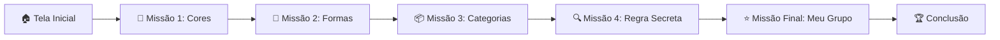

# 🌟 Missão dos Agrupamentos

Aplicação educacional interativa, 100% estática e acessível, desenvolvida para alunos do **1º ano do Ensino Fundamental** (faixa etária de 6 a 7 anos) com foco no desenvolvimento do pensamento computacional e raciocínio lógico.

---

## 🎯 Alinhamento Curricular com a BNCC

- **Código da Habilidade**: `EF01CO01`
- **Descrição da Habilidade**: *"Reconhecer que os objetos podem ser agrupados de diferentes maneiras a partir de características comuns (como cor, forma, tamanho, textura, categoria/uso etc.) e descrever as características de cada agrupamento."*
- **Eixos do Pensamento Computacional**:
  - **Reconhecimento de Padrões**: Identificar propriedades comuns e contrastantes entre itens do cotidiano.
  - **Abstração**: Focar no atributo relevante (ex.: focar na cor e ignorar a forma geométrica).
  - **Flexibilidade Cognitiva**: Perceber que um mesmo objeto pode pertencer a múltiplos grupos dependendo do critério do observador.

---

## 🎮 Estrutura das 5 Missões



1. **Tela Inicial**: Boas-vindas com o mascote *Lino, o Guaxinim*, instrução simples e botão destacado "Começar Missão".
2. **Missão 1 — O Desafio das Cores**: Agrupar objetos que compartilham a cor amarela (banana, sol, patinho).
3. **Missão 2 — O Enigma das Formas**: Reconhecer objetos com formato redondo/circular (moeda, relógio, botão).
4. **Missão 3 — O Baú das Categorias**: Classificar figuras por função/natureza (animais vivos vs. brinquedos/alimentos/transportes).
5. **Missão 4 — Descubra a Regra Secreta**: Dedução indutiva da característica comum de um grupo pré-formado (todos são vermelhos).
6. **Missão Final — Meu Agrupamento Criativo**: A criança escolhe a sua própria regra e seleciona os objetos compatíveis.
7. **Tela de Conclusão & Síntese**: Celebração com as 5 medalhas e reforço da tese: *"Os mesmos objetos podem formar grupos diferentes dependendo da característica que observamos!"*

---

## 💡 Diretrizes de Feedback Pedagógico (Sem Punição)

- **Feedback de Sucesso**: Comemoração positiva explicando verbal e textualmente a característica que une os objetos.
- **Feedback Formativo (Ajuste)**: O sistema **nunca** exibe mensagens secas de "errado" ou penalidades. Ele oferece uma dica acolhedora incentivando a criança a observar os atributos novamente.
- **Andaime Pedagógico (Scaffolding)**: Na 2ª tentativa com dúvida, o sistema ativa um brilho suave nos itens pertinentes para manter a auto-eficácia da criança.

---

## ♿ Acessibilidade e Usabilidade Infantil

- **Síntese de Voz Nativa (Web Speech API)**: Botão de áudio para leitura em voz alta das instruções e feedbacks em português brasileiro (`pt-BR`).
- **Alvos de Toque Amplos**: Cartões com dimensões $\ge 56\text{px}$ com margens seguras para manuseio em telas *touch*.
- **Alto Contraste e Tipografia Infantil**: Fontes arredondadas de alta legibilidade (Comic Neue / Nunito) e ícones vetoriais SVG nítidos em qualquer resolução.
- **Zero Cadastro / Total Privacidade**: Sem login, sem senhas e sem coleta de dados pessoais (em conformidade com a LGPD Infantil).

---

## 📱 Responsividade Multiplataforma

- **Smartphones**: Layout adaptado em 2 colunas para toques precisos.
- **Tablets**: Layout em 3 colunas, ideal para uso escolar compartilhado.
- **Desktop / Lousa Digital**: Visualização centralizada e confortável para uso individual ou com mediação do professor.

---

## 🛠️ Tecnologias Utilizadas

- **HTML5** semântico e acessível (`aria-live`, `aria-pressed`, `aria-label`).
- **CSS3** moderno (CSS Grid, Flexbox, Variáveis CSS, Animações suaves).
- **JavaScript Puro (ES6+)** sem frameworks ou dependências externas.
- **Web Speech API** e **Web Audio API** nativas do navegador.

---

## 🚀 Como Executar Localmente

Como a aplicação é 100% estática, não é necessário instalar nenhum pacote Node.js ou banco de dados.

1. **Abrir diretamente**:
   - Dê um duplo clique no arquivo `index.html` em qualquer navegador moderno (Chrome, Edge, Safari, Firefox).
2. **Ou executar com servidor local simples**:
   ```bash
   # Com Python 3
   python -m http.server 8000
   # Acesse no navegador: http://localhost:8000
   ```

---

## 🌐 Publicação no GitHub Pages

1. Faça o commit e envie os arquivos para o seu repositório no GitHub:
   ```bash
   git add .
   git commit -m "feat: publicacao da aplicacao Missao dos Agrupamentos"
   git push origin main
   ```
2. No repositório GitHub:
   - Acesse **Settings** > **Pages**.
   - Em **Source**, selecione a branch `main` e a pasta `/ (root)`.
   - Clique em **Save**.
3. Em instantes, a aplicação estará online e acessível publicamente no endereço:
   `https://<seu-usuario>.github.io/<nome-do-repositorio>/`
