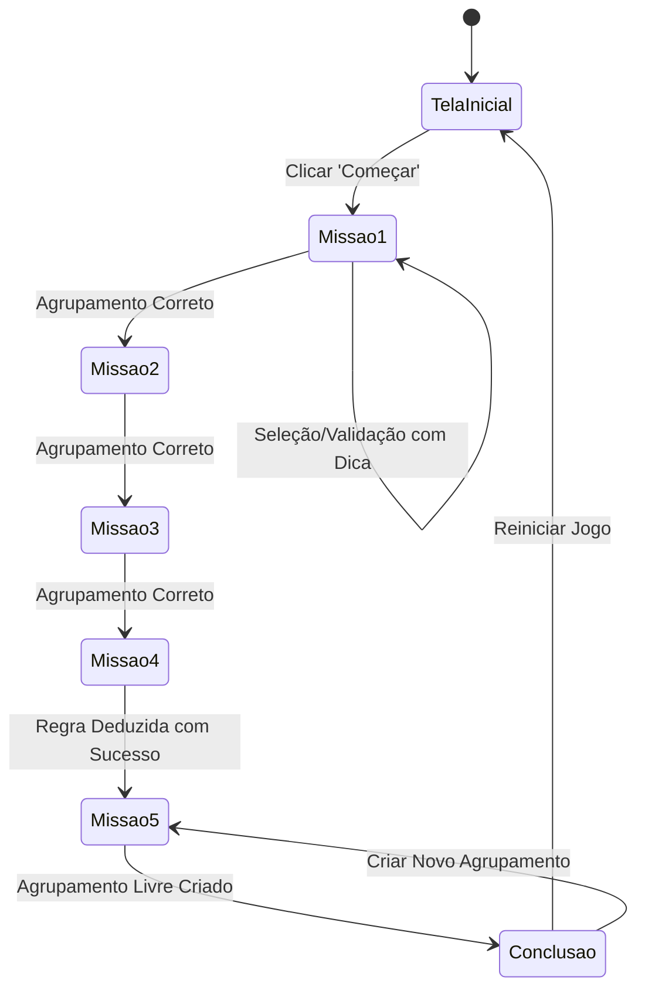

# Phase 1 Data Model: Missão dos Agrupamentos

**Feature**: Missão dos Agrupamentos  
**Storage Context**: In-Memory State (com persistência de sessão leve em JavaScript)  

---

## 1. Estruturas de Dados Centrais (`js/data.js`)

### 1.1 Catálogo de Objetos Educacionais (`GameObject`)
Cada objeto manipulável no jogo possui propriedades multimodais que permitem agrupamentos por diferentes critérios:

```javascript
/**
 * @typedef {Object} GameObject
 * @property {string} id - Identificador único (ex: 'banana', 'maca', 'carro')
 * @property {string} name - Nome legível em português (ex: 'Banana')
 * @property {string} svg - String SVG vetorial ou caminho do ícone
 * @property {string} color - Cor predominante ('amarelo', 'vermelho', 'azul', 'verde', 'laranja')
 * @property {string} shape - Formato geométrico básico ('redondo', 'quadrado', 'triangular', 'retangular')
 * @property {string} category - Categoria de uso/natureza ('alimento', 'animal', 'brinquedo', 'transporte')
 * @property {string} hint - Dica de observação associada ao objeto
 */
```

#### Exemplos de Instâncias no Catálogo:
1. `banana`: `{ id: 'banana', name: 'Banana', color: 'amarelo', shape: 'alongado', category: 'alimento' }`
2. `sol`: `{ id: 'sol', name: 'Sol', color: 'amarelo', shape: 'redondo', category: 'natureza' }`
3. `pato`: `{ id: 'pato', name: 'Pato de Borracha', color: 'amarelo', shape: 'organico', category: 'brinquedo' }`
4. `maca`: `{ id: 'maca', name: 'Maçã', color: 'vermelho', shape: 'redondo', category: 'alimento' }`
5. `relogio`: `{ id: 'relogio', name: 'Relógio de Parede', color: 'azul', shape: 'redondo', category: 'objeto' }`
6. `moeda`: `{ id: 'moeda', name: 'Moeda', color: 'amarelo', shape: 'redondo', category: 'objeto' }`
7. `cachorro`: `{ id: 'cachorro', name: 'Cachorro', color: 'marrom', shape: 'organico', category: 'animal' }`
8. `gato`: `{ id: 'gato', name: 'Gatinho', color: 'cinza', shape: 'organico', category: 'animal' }`
9. `carro_bombeiro`: `{ id: 'carro_bombeiro', name: 'Carro de Bombeiro', color: 'vermelho', shape: 'retangular', category: 'transporte' }`

---

### 1.2 Configuração das Missões (`MissionConfig`)

```javascript
/**
 * @typedef {Object} MissionConfig
 * @property {number} id - Número da missão (1 a 5)
 * @property {string} title - Título da missão (ex: 'Missão 1 — Cores')
 * @property {string} mascotInstruction - Fala do personagem guia
 * @property {string} criterionType - 'color' | 'shape' | 'category' | 'deduce_rule' | 'custom_group'
 * @property {string} targetAttribute - Atributo/valor esperado para agrupamento (ex: 'amarelo', 'redondo', 'animal')
 * @property {string[]} itemIds - IDs dos objetos disponíveis no grid
 * @property {string[]} correctIds - IDs dos objetos que satisfazem a regra (para validação)
 * @property {Object} feedback - Textos e dicas formativas
 * @property {string} feedback.success - Mensagem de comemoração e explicação do critério
 * @property {string} feedback.hint - Dica pedagógica amigável para revisão
 */
```

---

### 1.3 Estado da Aplicação em Execução (`AppState`)

```javascript
/**
 * @typedef {Object} AppState
 * @property {'home' | 'mission' | 'conclusion'} currentScreen - Tela ativa
 * @property {number} currentMissionIndex - Índice da missão atual (0 a 4)
 * @property {Set<string>} selectedItemIds - Itens atualmente marcados pela criança
 * @property {string|null} customCriterion - Critério selecionado pelo usuário na Missão Final
 * @property {number} attemptsInCurrentMission - Contador de tentativas para ativação de andaimes/dicas visuais
 * @property {boolean[]} completedMissions - Status de conclusão de cada uma das 5 missões
 * @property {boolean} isAudioMuted - Flag de ativação/desativação do som
 */
```

---

## 2. Máquina de Estados e Transições


