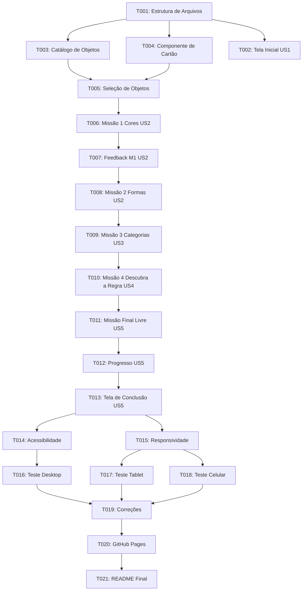

# Tasks: Missão dos Agrupamentos

**Feature**: Missão dos Agrupamentos  
**Branch**: `001-missao-agrupamentos` | **Spec**: [spec.md](./spec.md) | **Plan**: [plan.md](./plan.md)  
**Status**: Ready for Implementation  

---

## Task Summary & Phase Organization

- **Total Tasks**: 21
- **Phase 1: Setup & Estrutura Inicial** (T001)
- **Phase 2: Fundações e Catálogo de Dados** (T003, T004, T005)
- **Phase 3: User Story 1 — Acolhimento & Tela Inicial** (T002)
- **Phase 4: User Story 2 — Missões 1 e 2 (Cores & Formas)** (T006, T007, T008)
- **Phase 5: User Story 3 — Missão 3 (Categorias)** (T009)
- **Phase 6: User Story 4 — Missão 4 (Descobrir a Regra)** (T010)
- **Phase 7: User Story 5 — Missão Final & Conclusão** (T011, T012, T013)
- **Phase 8: Qualidade, Acessibilidade & Responsividade** (T014, T015)
- **Phase 9: Validação Multiplataforma & Ajustes** (T016, T017, T018, T019)
- **Phase 10: Publicação & Documentação** (T020, T021)

---

## Tasks List

### Phase 1: Setup & Estrutura Inicial

- [x] T001 Criar estrutura básica de arquivos e diretórios (`index.html`, `css/style.css`, `js/app.js`, `js/data.js`, `assets/images/`) em `Projeto-final-Padrões/`

---

### Phase 2: Fundações e Catálogo de Dados

- [x] T003 [P] Criar banco local de objetos com catálogo de itens multimodais (cor, forma, categoria, svg, dica) em `Projeto-final-Padrões/js/data.js`
- [x] T004 [P] Desenvolver componente visual dos cartões (`.object-card`) com estilização de ícones SVG e foco visual em `Projeto-final-Padrões/css/style.css`
- [x] T005 Implementar mecânica de seleção de objetos com toque/clique simples, realce de contorno e desmarcação em `Projeto-final-Padrões/js/app.js`

---

### Phase 3: User Story 1 — Acolhimento & Tela Inicial (Priority: P1)

*Goal: Permitir que a criança acesse o jogo, seja recepcionada pelo mascote Lino e inicie a atividade com facilidade.*

- [x] T002 [US1] Criar tela inicial (`#screen-home`) com ilustração do mascote Lino, título lúdico e botão destacado "Começar" em `Projeto-final-Padrões/index.html` e `Projeto-final-Padrões/css/style.css`

---

### Phase 4: User Story 2 — Missões 1 e 2 (Cores & Formas) (Priority: P1)

*Goal: Exercitar a percepção de atributos visuais primários (cor e forma geométrica) com validação explicativa.*

- [x] T006 [US2] Implementar Missão 1 (Cores) com grid de 6 objetos e identificação da cor alvo em `Projeto-final-Padrões/js/app.js`
- [x] T007 [US2] Implementar feedback pedagógico formativo da Missão 1 com explicação da regra comum e dicas sem punição em `Projeto-final-Padrões/js/app.js` e `Projeto-final-Padrões/css/style.css`
- [x] T008 [US2] Implementar Missão 2 (Formas) com reconhecimento de objetos com contorno redondo/circular em `Projeto-final-Padrões/js/app.js` e `Projeto-final-Padrões/js/data.js`

---

### Phase 5: User Story 3 — Missão 3 (Categorias) (Priority: P2)

*Goal: Classificar figuras com base em categorias funcionais e semânticas (animais, alimentos, brinquedos, transportes).*

- [x] T009 [US3] Implementar Missão 3 (Categorias) permitindo organizar objetos no baú pela categoria informada em `Projeto-final-Padrões/js/app.js`

---

### Phase 6: User Story 4 — Missão 4 (Descobrir a Regra) (Priority: P2)

*Goal: Desenvolver raciocínio indutivo apresentando um grupo pré-formado para a dedução da regra comum.*

- [x] T010 [US4] Implementar Missão 4 (Descobrir a Regra) exibindo grupo pré-definido e botões de alternativas com pictogramas em `Projeto-final-Padrões/js/app.js` e `Projeto-final-Padrões/index.html`

---

### Phase 7: User Story 5 — Missão Final & Conclusão (Priority: P1)

*Goal: Permitir ao aluno criar seu próprio agrupamento e consolidar a tese central da BNCC EF01CO01.*

- [x] T011 [US5] Implementar Missão Final (Meu Agrupamento) com seleção prévia do critério e validação dinâmica dos itens em `Projeto-final-Padrões/js/app.js`
- [x] T012 [US5] Implementar componente visual de progresso (`.mission-tracker`) com 5 etapas e medalhas comemorativas em `Projeto-final-Padrões/index.html` e `Projeto-final-Padrões/css/style.css`
- [x] T013 [US5] Implementar tela de conclusão (`#screen-conclusion`) com reforço da frase da BNCC EF01CO01 e botão de reiniciar em `Projeto-final-Padrões/index.html` e `Projeto-final-Padrões/js/app.js`

---

### Phase 8: Qualidade, Acessibilidade & Responsividade

- [x] T014 [P] Ajustar acessibilidade infantil com narração por voz (Web Speech API em pt-BR), contraste WCAG e alvos de toque $\ge 56\text{px}$ em `Projeto-final-Padrões/js/app.js` e `Projeto-final-Padrões/css/style.css`
- [x] T015 [P] Implementar responsividade completa com CSS Grid e Media Queries para celular (2 colunas), tablet (3 colunas) e desktop em `Projeto-final-Padrões/css/style.css`

---

### Phase 9: Validação Multiplataforma & Ajustes

- [x] T016 Testar fluxo completo em ambiente Desktop (mouse, teclado e proporções amplas)
- [x] T017 Testar layout e usabilidade em Tablet (7" a 12.9", toques simultâneos e legibilidade)
- [x] T018 Testar experiência em Celular (telas a partir de 4.7", orientação e touch)
- [x] T019 Corrigir problemas encontrados durante as rodadas de testes e refinar feedbacks

---

### Phase 10: Publicação & Documentação

- [x] T020 Preparar e verificar estrutura estática para publicação direta no GitHub Pages
- [x] T021 Finalizar documentação do projeto no `Projeto-final-Padrões/README.md` com instruções pedagógicas e técnicas

---

## Dependências e Sequenciamento

---

## Oportunidades de Execução Paralela

- **T003 e T004**: O catálogo de dados (`js/data.js`) e os estilos dos cartões (`css/style.css`) podem ser desenvolvidos em paralelo.
- **T014 e T015**: As melhorias de acessibilidade por voz (Web Speech) e os ajustes de responsividade (Media Queries) podem ser refinados simultaneamente.
- **T016, T017 e T018**: Os testes de plataforma (Desktop, Tablet e Mobile) podem ser executados em paralelo.

---

## Escopo MVP Recomendado

O MVP funcional mínimo compreende as tarefas **T001 a T007** (Estrutura + Catálogo + Tela Inicial + Mecânica de Seleção + Missão 1 com Feedback Pedagógico). As missões subsequentes (T008 a T013) expandem o repertório de classificação e consolidam a flexibilidade cognitiva da BNCC EF01CO01.
